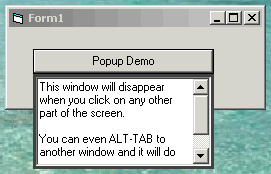



## Demo: Popup Window \(like menu or drop\-down windows\) \(No hooks\)

### Description

One of the most common types of a focus-only popup window is the menu. A drop-down list is another example. Both disappear when they lose focus.

Here's a demonstration of how to do that. It doesn't rely on the LostFocus event, which only works within that form's scope. Switch to a different application and your popup would still be visible. Instead, it uses a timer and an API call to check to see if the popup still has global focus. If not, it self-unloads.

While it does act essentially like menu-style popup windows, it's not exactly the same. To do that, I think it's necessary to use an API call to hook into some Windows event that detects a change in overall focus. This technique relies on constantly polling the OS. It also means the form that uses the popup will technically lose focus (big deal). It's generally a little klunky. Still, it works very well.

Thanks go out to MrGTI (www.Pharfruminsain.com) for advice on the basic technique. I encourage anyone who knows the "right" way of doing this to let me know.

Please vote for this code if you like it.
 
### More Info
 

             |
---                |---
**Submitted On**   |2000-07-06 11:20:10
**By**             |[James Vincent Carnicelli](https://github.com/Planet-Source-Code/PSCIndex/blob/master/ByAuthor/james-vincent-carnicelli.md)
**Level**          |Intermediate
**User Rating**    |5.0 (25 globes from 5 users)
**Compatibility**  |VB 3\.0, VB 4\.0 \(16\-bit\), VB 4\.0 \(32\-bit\), VB 5\.0, VB 6\.0, VB Script, ASP \(Active Server Pages\) 
**Category**       |[Custom Controls/ Forms/  Menus](https://github.com/Planet-Source-Code/PSCIndex/blob/master/ByCategory/custom-controls-forms-menus__1-4.md)
**World**          |[Visual Basic](https://github.com/Planet-Source-Code/PSCIndex/blob/master/ByWorld/visual-basic.md)
**Archive File**   |[CODE\_UPLOAD7483762000\.zip](https://github.com/Planet-Source-Code/james-vincent-carnicelli-demo-popup-window-like-menu-or-drop-down-windows-no-hooks__1-9552/archive/master.zip)

